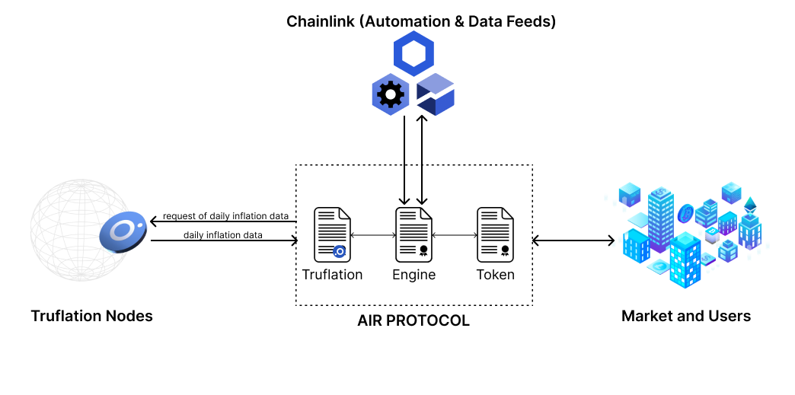
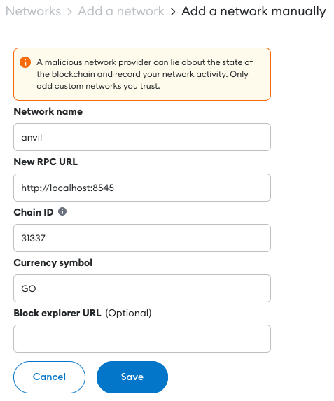
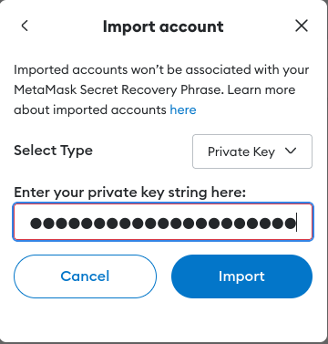
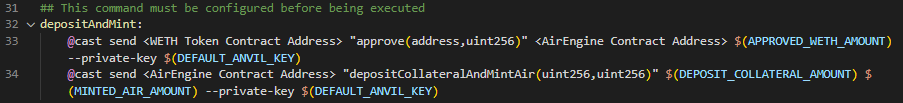
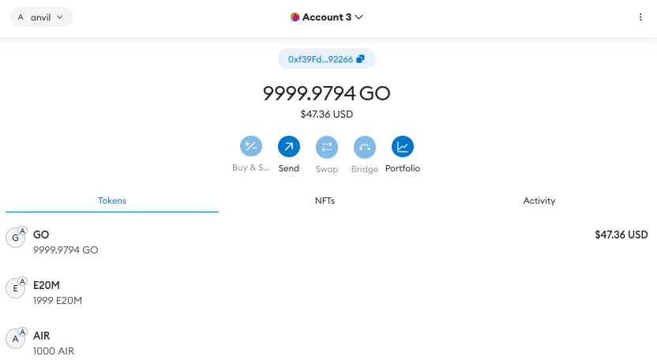

# Against Inflation Rate Protocol (AIR Protocol)

### About

AIR protocol is a flatcoin protocol that sets its price initially at one US dollar and then updates it daily given the daily inflation data provided by Truflation (oracle working with Chainlink) and triggered by Chainlink Automation. This protocol intends to simulate the operation of MakerDao's DAI, only its peg is not fixed.

<figure><figcaption><p>Air protocol architecture</p></figcaption></figure>

### Getting Started

#### Requirements:

First of all, install Make:



#### Then, install Foundry:



To use this code, you need to have installed [foundry](https://github.com/crisgarner/awesome-foundry).

To check if you have it installed:

```shell
# In case you have it installed you will see the version
$ forge --version

```

#### Quickstart:

Install the necessary dependencies:

```shell
$ make install
```

### Usage

#### Locally:

First of all, add anvil network to Metamask.

1. Go to "Settings> Networks> Add a network> Add a network manually"

<figure><figcaption><p>How to fill network data</p></figcaption></figure>

2. Switch to anvil network.

Now add your anvil account to Metamask:

I recommend using the following private key as account to avoid re configuring the environment:

```bash
0xac0974bec39a17e36ba4a6b4d238ff944bacb478cbed5efcae784d7bf4f2ff80
```

<figure><figcaption><p>Example of adding an account</p></figcaption></figure>

Then deploy the protocol to start interacting with it.

```bash
$ make deploy
```

Printed on the console you will find the following logs:

<figure><figcaption><p>Logs example</p></figcaption></figure>

Import the WETH contact as a token on Metamask:

<figure><figcaption><p>Import a token example</p></figcaption></figure>

You will immediately see you have balance because the "make deploy" command in addition to deploying the protocol, it minted some tokens for us.

Now, you need to import the AIR token to Metamask (same procedure but use the AIR Contract Address from the logs).

As we still don't have AIR tokens, we need to deposit some collateral to the engine to mint some.&#x20;

Open the makefile file. There you will find the depositAndMint command. Use the logs to configure it:

<figure><figcaption><p>Command before configuration</p></figcaption></figure>

Execute the command:

```bash
$ make depositAndMint
```

Your balance on Metamask should be like this:

<figure><figcaption><p>Metamask status after deposit and mint</p></figcaption></figure>

**Congrats! You have deployed the protocol and its testing components. Now you can start playing around with some other commands to see how the protocol behaves.**&#x20;

**Thank you for taking the time to read and use the Anti Inflation Rate protocol!**

#### Testnet:

This option is not yet available through the command line.&#x20;


**Recommendations:**

* Try executing other commands to update AIR price by inflation, to liquidate a user, to mint some more tokens, etc.
* Audit the protocol! This codebase probably has a couple of security issues I haven't find out.
* Star the project! ⭐
